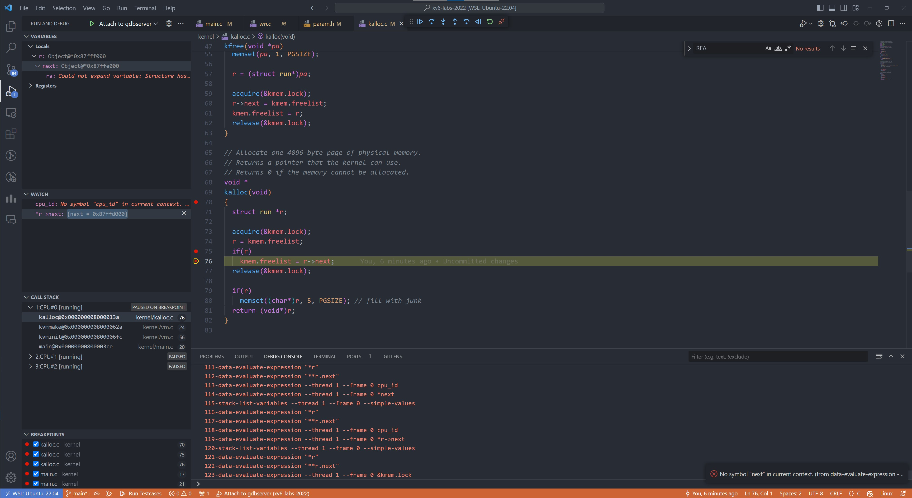

## MIT 6.1810: Operating System Engineering
Course Website: https://pdos.csail.mit.edu/6.828/2022/schedule.html

## Environment Setup
I use WSL(Ubuntu-22.04) + docker to run xv6, this is how I set up the environment:

```commandline
docker run -it -v $PWD:/xv6-riscv -p 127.0.0.1:8080:25000 jjolly/xv6
```
You will need to map the default gdb port to localhost by above command.

Since the grading script was written in python, you have to install python inside docker container.
```commandline
apt-get update
apt-get install -y python3
```

Note that if you use windows you have to set Line Separator to `LF`, otherwise the grade-lab script will fail to run.

## Debug with VS code
To use the integrated GUI debugger in VS code:

[//]: # (1. Install this vscode extension: [GDB Debugger - Beyond]&#40;https://marketplace.visualstudio.com/items?itemName=coolchyni.beyond-debug&#41;)
<!---2. Add this configuration to your `launch.json`
    ```json
    {
        "type": "by-gdb",
        "request": "launch",
        "name": "Launch(gdb)",
        "program": "${fileBasenameNoExtension}",
        "cwd": "${workspaceRoot}",
        "remote": { 
            "enabled": true,
            "address": ":8080",
            "mode": "remote",
            "execfile": "${fileBasenameNoExtension}"
        }
    }
    ```-->
1. Install this vscode extension: [Native Debug](https://marketplace.visualstudio.com/items?itemName=webfreak.debug)
   <br> This extension allow you to attach to remote gdbserver within your docker container.
2. Install gdb-multiarch on your wsl.
    ```commandline
    apt install gdb-multiarch
    ``` 
3. Add the following configuration to your `launch.json` file.
    ```json
    {
        "type": "gdb",
        "request": "attach",
        "name": "Attach to gdbserver",
        "gdbpath": "/usr/bin/gdb-multiarch",
        "executable": "kernel/kernel",
        "target": "127.0.0.1:8080",
        "remote": true,
        "printCalls": true,
        "cwd": "${workspaceRoot}",
        "valuesFormatting": "parseText"
    }
    ```
4. Start gdbserver:
    ```commandline
    make qemu-gdb
    ```
    Now you can click the debug button "Attach to gdbserver" and add some breakpoint to debug the program.



## Reference
- docker image tutorial: [Video](https://youtu.be/juA01R9PzTI?si=Hp7EpYBUeaUmvIva) <br>
  I used the docker image provided by jjolly, checkout this video for step-by-step tutorial.  
- xv6 source dive: [Video](https://youtube.com/playlist?list=PLP29wDx6QmW4Mw8mgvP87Zk33LRcKA9bl&si=5Gls4En3EeFMkq9i) <br>
  This series offers valuable insights during lab sessions. 
For a deeper comprehension of xv6 implementation, these videos are highly recommended.
